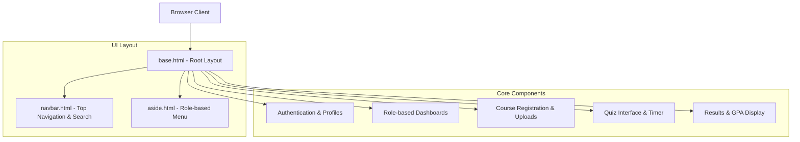
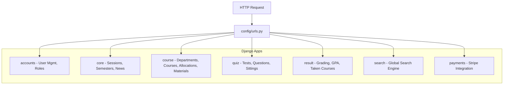
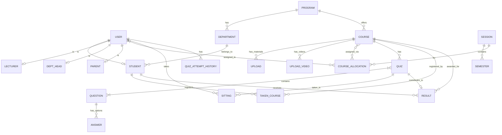
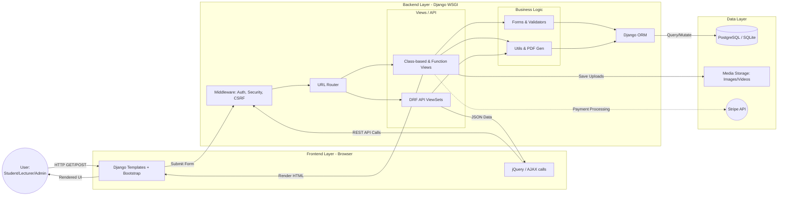

# Project Architecture Documentation

## 1. Tech Stack

### Frontend
- **Languages**: HTML5, CSS3, JavaScript (Vanilla & AJAX)
- **Frameworks/Libraries**: Bootstrap 4, jQuery, Popper.js
- **Icons & UI**: Font Awesome
- **Template Engine**: Django Template Language (DTL)
- **Form Handling**: django-crispy-forms

### Backend
- **Core Framework**: Python with Django (>=3.2)
- **API Layer**: Django REST Framework (DRF)
- **Database ORM**: Django ORM
- **Authentication**: Django Auth, Session Authentication, Custom User Models
- **File Handling**: Pillow (Images), xhtml2pdf/reportlab (PDF Generation)
- **Static Files**: Whitenoise
- **Other Utilities**: django-environ, django-filter, django-cors-headers

### Database
- **Production DB**: PostgreSQL (psycopg2)
- **Development DB**: SQLite3

---

## 2. Architecture Overview

**Architecture Type**: Monolithic Application (Django MTV - Model-Template-View pattern) with RESTful API extensions.

The application follows a traditional server-rendered monolithic structure where the Django backend handles business logic, database operations, and renders HTML templates directly to the client. It also exposes API endpoints for potential decoupled client interactions.

### Frontend Architecture

The frontend is divided into role-based components (Admin, Lecturer, Student), primarily utilizing server-side rendering with conditional blocks based on user permissions.

### Backend Architecture

The backend is modularized into several Django applications, each responsible for a specific domain of the student management system.

### Database Schema

Here are the detailed schemas mapping out the entities across the system.

#### Detailed Schemas:
- **`accounts`**: User (Custom AbstractUser), Student (Level, Dept, Faculty), DepartmentHead, Parent.
- **`core`**: NewsAndEvents, ActivityLog, Session (Academic year), Semester (First/Second).
- **`course`**: Program (Faculty), Department, Course (Code, Credit, Level), CourseAllocation (Lecturer mapping), Upload (Files), UploadVideo (Media).
- **`quiz`**: Quiz, Question (Abstract), MCQuestion, Answer, EssayQuestion, Sitting (Tracks active quiz session, progress, answers), QuizAttemptHistory.
- **`result`**: TakenCourse (Registration), Result (CA, Mid-exam, Quiz, Exam, Total, Grade, Point, CGPA logic).

### Final Full Architecture & Data Flow

This chart represents the holistic view of how a user interacts with the system, how data flows through the monolithic stack, and how the database serves the applications.

